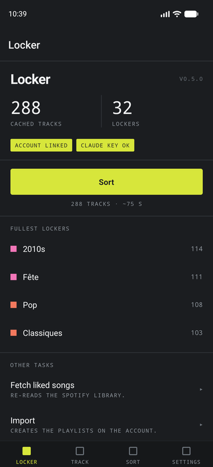
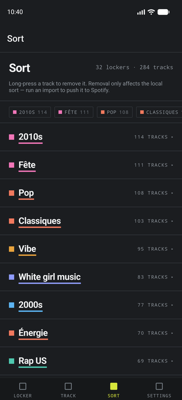
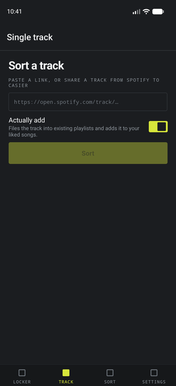
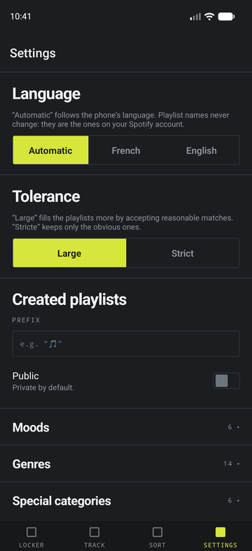

<p align="center">
  
</p>

<h1 align="center">Casier</h1>

<p align="center">
  Files your Spotify liked songs into themed playlists,<br>
  and lets Claude do the judging.
</p>

<p align="center">
  <a href="README.md">Français</a> · <b>English</b>
</p>

<p align="center">
  
  
  
  
</p>

---

A track can belong to several playlists, and no track is left behind.
Command line, web panel and Android app, all on the same engine.

```bash
python main.py fetch    # reads your liked songs
python main.py sort     # sorts them — writes files only
python main.py import out/playlists.json   # creates the playlists on your account
```

Nothing is created on your account until you run `import`.

> *Casier* is French for a pigeonhole — one of the slots you file things into.

## Why Claude rather than the Spotify API

Spotify removed access to *audio features* (energy, danceability, valence,
tempo) for new applications in late 2024. And even back when they existed, no
API could tell you that a track is a classic, a joke, or from a TV soundtrack.

So sorting happens on two levels:

| Level | What it decides | How |
|---|---|---|
| Rules | decades (1950s → 2020s), “very old” | album release date |
| Claude | mood, genre, classics, novelty, film and TV… | semantic judgement on the metadata |

## The three surfaces

| | What it's for |
|---|---|
| **CLI** | the full engine, scriptable, ideal for the first big pass |
| **Web panel** | drive everything from a browser, watch a sort live, edit the taxonomy |
| **Android app** | from Spotify, “Share → Casier” files a track in one gesture |

All three share `service.py` and `jobs.py`: a sort started from the phone can be
followed from the computer, and the other way round.

## Generated playlists

**Moods** — Chill · Vibe · Fête · Mélancolie · Énergie · Romance
**Genres** — Rap US · Rap UK · Rap FR · Pop · Rock · Metal · Électro · R&B/Soul · Jazz/Blues · Reggae/Afro · Latino · Country/Folk · Classique/Instrumental · Chanson française
**Special** — Classiques · Classiques français · White girl music · Troll · Films et séries · Très vieux
**Decades** — 1950s → 2020s

Playlist names ship in French because they become the real playlist names on
your account. Rename them freely in `spotify_sort/config.py` or from the web
panel — the sort follows.

Everything is editable in `config.py`: add a key to the right dictionary with a
description and it is automatically picked up by the prompt, the export and the
import.

### Tuning how full the playlists get

`TOLERANCE` in `config.py`:

- `"large"` (default) — fuller playlists: several moods and genres per track,
  and a reasonable match is enough for the special categories.
- `"stricte"` — one mood, one genre, and only the obvious ones.

### Reference playlists

The best way to pin down a fuzzy category is to show examples rather than
describe them. `REFERENCE_PLAYLISTS` maps an existing playlist of yours to a
category:

```python
REFERENCE_PLAYLISTS = {
    "white girl music vieux": "white-girl-music",
}
```

Its tracks are injected into the prompt as an authoritative reference: the model
infers the common thread and applies it broadly, including to artists absent
from your list.

## Installation

```bash
pip install -r requirements.txt
```

### 1. Spotify app

Create an app at <https://developer.spotify.com/dashboard> and add this Redirect
URI **exactly**:

```
http://127.0.0.1:8888/callback
```

Then:

```bash
export SPOTIFY_CLIENT_ID=your_client_id
```

No client secret: the tool uses the OAuth PKCE flow. The token is cached in
`~/.spotify-sort/token.json` and refreshed automatically.

### 2. Claude API key

```bash
export ANTHROPIC_API_KEY=sk-ant-...
```

(or `ant auth login`, which the SDK picks up on its own).

## Usage

```bash
# 1. Fetch the liked songs (and the artists' genres)
python main.py fetch

# 2. Sort and export — writes files only, never touches the account
python main.py sort

# Quick test on 40 tracks before running the whole library
python main.py sort --limit 40

# 3. See what the import would do, without creating anything
python main.py import out/playlists.json --dry-run

# 4. Create the playlists on your account
python main.py import out/playlists.json

# Or only some of them
python main.py import out/playlists.json --only troll white-girl-music rap-us
```

### Sorting a single track

For a song discovered after the fact, without re-running the whole sort:

```bash
# Says which playlists it belongs to, without changing anything
python main.py track "https://open.spotify.com/track/4cOdK2wGLETKBW3PvgPWqT"

# And actually adds it
python main.py track "https://open.spotify.com/track/..." --add

# Several at once
python main.py track LINK1 LINK2 LINK3 --add
```

Accepts an `open.spotify.com` link (with or without `?si=`, `/intl-xx/` URLs
included), a `spotify:track:…` URI or a bare ID. With `--add`, a track already
there is not added twice, and playlists missing from your account are reported
rather than created.

### Staying consistent with Liked Songs

Any track filed into a playlist is also added to Liked Songs if it isn't there
already. To catch up on what already exists:

```bash
python main.py sync-likes --dry-run   # lists without changing anything
python main.py sync-likes             # likes the missing ones
```

> These operations require the `user-library-modify` scope. A token obtained
> before it was added doesn't have it: the tool detects this and asks for a new
> authorisation.

### Files produced

| File | Contents |
|---|---|
| `out/liked.json` | raw cache of the liked songs |
| `out/playlists.json` | the sort — this is what `import` consumes |
| `out/tracks.csv` | one row per track with its playlists, to read in a spreadsheet |

Since `playlists.json` is a plain text file, you can fix it by hand before
importing: move a track, empty a playlist, rename one.

## Web panel

Single-user, meant to run behind an HTTPS reverse proxy.

```bash
export WEB_PASSWORD='a long passphrase'          # required, 12 chars minimum
export BASE_URL='https://sort.example.com'       # required
export SPOTIFY_CLIENT_ID='...'
export ANTHROPIC_API_KEY='sk-ant-...'

gunicorn -w 1 -b 127.0.0.1:8000 webapp:app
```

Add `https://sort.example.com/spotify/callback` to your Spotify app's Redirect
URIs — the dashboard shows the exact URL if you're unsure.

> **`-w 1` is not optional.** Jobs and their logs live in the process's memory.
> With several workers, a progress page would land at random on a worker that
> knows nothing about the job.

`TRUST_PROXY=1` is required behind a reverse proxy: without it the app ignores
`X-Forwarded-Proto` and builds an `http://` `redirect_uri`, which Spotify
rejects.

Full deployment — TLS, hardened systemd unit, certificate for the Android app —
is described in [`deploy/README.md`](deploy/README.md).

| Page | Role |
|---|---|
| Dashboard | status (Spotify, Claude key, caches), launching jobs, diagnostics |
| Progress | live log of the running job |
| Result | playlists and tracks, removing a track, selecting then importing |
| Single track | paste a link, see the proposed playlists, add |
| Settings | tolerance, reference playlists, editing the taxonomy |

Settings are written to `out/settings.json` and override `config.py` at runtime.
The CLI reads the same file, so the two stay consistent.

### Security

- password required (refuses to start without one, or under 12 characters),
  compared in constant time, 8 attempts per IP per 5 minutes;
- session cookie `HttpOnly`, `SameSite=Lax`, `Secure`;
- CSRF token required on every POST, regenerated on sign-in;
- `?next=` restricted to internal paths, no open redirect;
- `meta noindex`, no secret rendered into the pages.

What remains **yours to provide: HTTPS.** Without it the password travels in the
clear and Spotify will refuse the callback.

## Android app

The gesture that justifies it: from Spotify, “Share → Casier” sorts the track
and adds it to the playlists and to Liked Songs, without leaving the app.

```
mobile/    Expo project — see mobile/README.md
api.py     JSON API /api/v1 consumed by the app
```

The app authenticates with the same `WEB_PASSWORD`, swapped once for a token
kept in the phone's secure storage. The server is reached over TLS with a
self-signed certificate that the app **alone** accepts: system certificate
authorities are explicitly excluded for that host.

The server address has no usable default — the repository ships `192.0.2.10`, a
documentation address. Set yours at build time:

```bash
export SPOTIFY_SORT_HOST=your.server SPOTIFY_SORT_PORT=8000
npx expo prebuild --platform android --clean
```

## Languages

The app and the panel are bilingual, French and English. The app follows the
phone's language, with an explicit choice in Settings; the panel follows the
browser's `Accept-Language` header.

Deliberately **not** translated: playlist names, which are the real names on
your Spotify account and which the import looks up by name, and the category
descriptions, which make up the prompt sent to Claude.

## Architecture

```
spotify_sort/service.py   business tasks, no Flask dependency
webapp.py                 HTML facade: Jinja, session cookie, CSRF
api.py                    JSON facade: bearer token, stable error codes
spotify_sort/jobs.py      long-running background jobs with a readable log
```

### Tests

```bash
python -m pytest          # API, jobs, service, panel regression, translations
cd mobile && npm test     # API client, colours, message catalogue
cd mobile && npx tsc --noEmit
```

## Troubleshooting

```bash
python main.py doctor
```

Tests every access right one by one — token scopes, reading the profile, the
library and the playlists, catalogue access, and creating a test playlist that
is deleted immediately. Each line shows ✓ or ✗ with Spotify's exact message,
which pinpoints a `403`.

### Web API migration of 9 March 2026

Spotify removed several write endpoints. This tool uses the replacements:

| Removed (403 for everyone) | Replacement used here |
|---|---|
| `POST /users/{id}/playlists` | `POST /me/playlists` |
| `POST /playlists/{id}/tracks` | `POST /playlists/{id}/items` |
| `PUT /me/tracks` | `PUT /me/library?uris=spotify:track:…` |
| `GET /artists?ids=…` | `GET /artists/{id}`, one request per artist |

Two shape changes that are easy to miss: `PUT /me/library` expects **full URIs
as a query parameter** (`uris=`), not bare IDs in the body, and caps at 40 per
call. And **every** `ids=` batch endpoint is gone — it takes one request per
item.

A `403` on a write with one of the left-hand paths in the URL means code still
on the old API.

### `403` on creation while every read succeeds

The token is valid and the path is right; the block is on the account or app
side. `doctor` prints the raw response body and hands you a ready-to-paste
`curl` to reproduce it outside the tool. Same 403 in curl ⇒ it isn't the code.

1. **App in Development Mode**: Spotify dashboard → your app → *User Management*.
   Your account must be listed with the exact display name **and** email.
2. **Account unable to create a playlist**: check by hand on open.spotify.com.
   A child or managed account cannot.
3. **Wrong account signed in**: `doctor` prints the ID the API sees.

### `403` on `/v1/artists`

That's the step fetching the artists' genres. It is optional: the tool falls
back to one request per artist, and if that is refused too it carries on without
genres. Classification then works on title / artist / album / year, which is
still most of the signal.

If you change the scopes in `config.py`, delete `~/.spotify-sort/token.json` to
force a fresh authorisation — the cached token keeps the old ones.

## Notes

- The import **skips** any playlist whose name already exists on your account —
  no existing playlist is modified or overwritten.
- The import is resumable: a failing playlist is reported and the rest carry on.
  After three failures in a row it stops, the problem being global.
- Playlists are created private (`PLAYLIST_PUBLIC` in `config.py`, or
  `--public`).
- Claude cost: tracks go out in batches of 40 with the prompt cached. Expect a
  few tens of cents for ~1000 tracks.
- A failing batch is reported and skipped: its tracks fall back to their decade
  playlist rather than bringing the whole run down.
- `fetch` writes `liked.json` **before** fetching genres: a failure at that step
  never loses the tracks already retrieved.

## Licence

MIT — see [LICENSE](LICENSE).

This project is affiliated with neither Spotify nor Anthropic. “Spotify” is a
registered trademark of Spotify AB, used here only to refer to the service.
